<h2>Μοντέλο Πεδίου</h2>

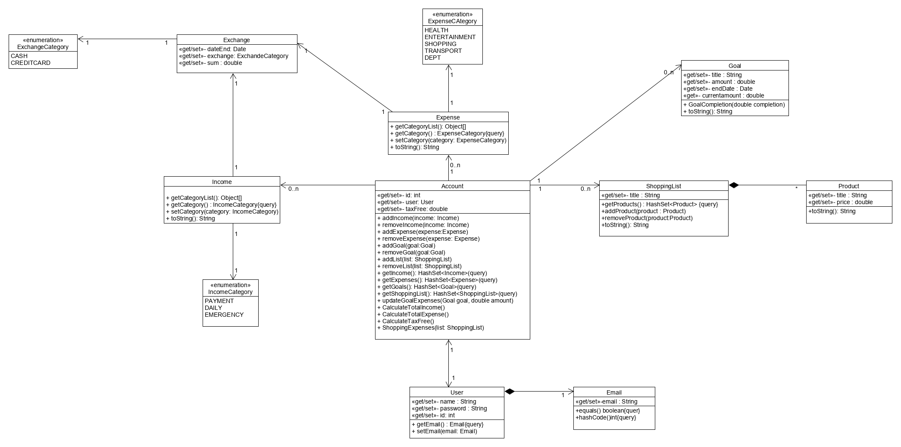

<h2>Συμπεριφορές</h2>

<h2>ΠΧ1. Αναφορές αφορολόγητου ορίου</h2>

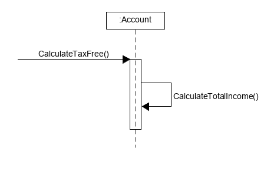

<h2>ΠΧ2. Αναφορές στόχων οικονομικής διαχείρισης</h2>

<h3>Α) Προβολή Εσόδων</h3>

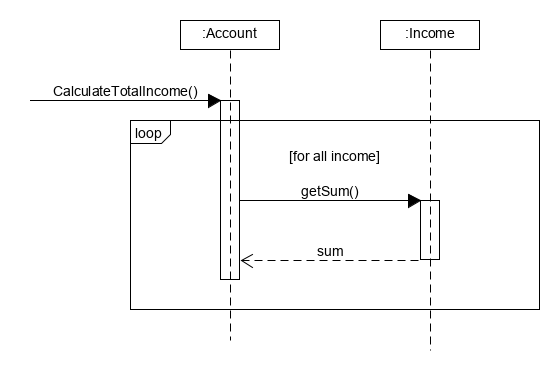

<h3>Β) Προβολή Εξόδων</h3>

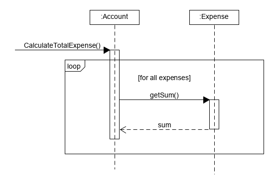

<h3>Γ) Προβολή Αποταμιευτικών Στόχων</h3>

<h2>ΠΧ3. Διαχείριση εσόδων/εξόδων</h2>

<h3>A) Εισαγωγή εσόδων</h3>

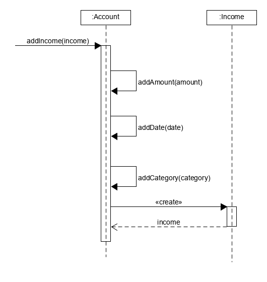

<h3>Β) Διαγραφή εσόδων</h3>

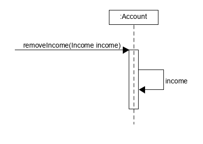

<h3>Γ) Εισαγωγή εξόδων</h3>

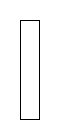

<h3>Δ) Διαγραφή εξόδων</h3>

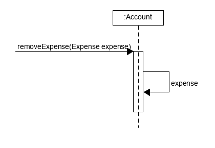

<h2>ΠΧ4. Διαχείριση λίστας αγορών</h2>

<h3>Α) Δημιουργία νέας λίστας αγορών</h3>

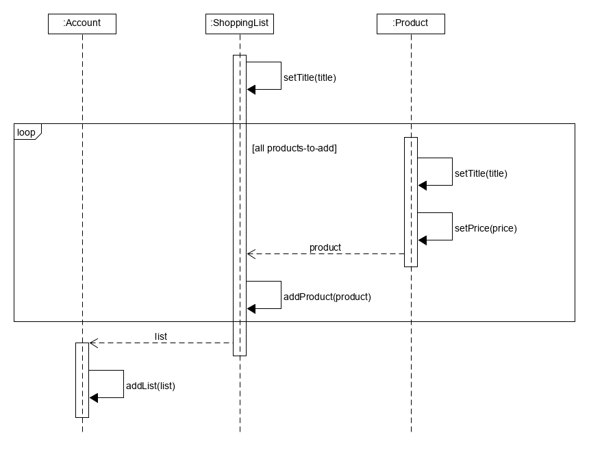

<h3>Β) Τροποποίηση λίστας αγορών</h3>

<h3>Γ) Διαγραφή λίστας αγορών</h3>

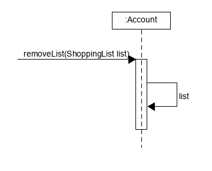

<h2>ΠΧ5. Διαχείριση στόχων αποταμίευσης</h2>

<h3>Α) Δημιουργία αποταμιευτικών στόχων</h3>

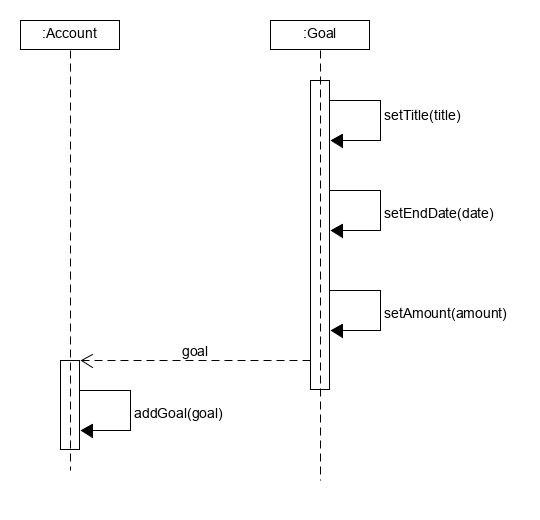

<h3>Β) Τροποποίηση αποταμιευτικών στόχων</h3>

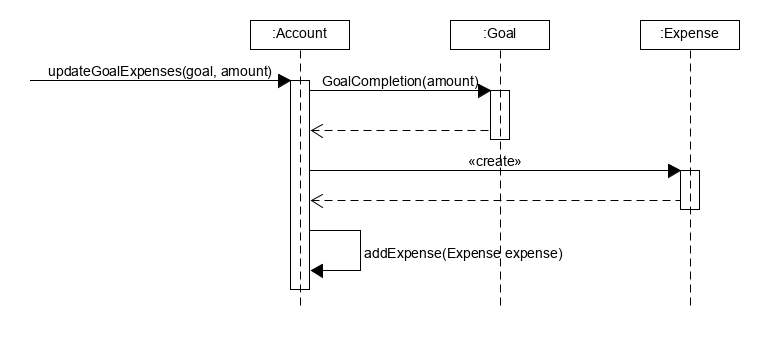

<h3>Γ) Διαγραφή αποταμιευτικών στόχων</h3>

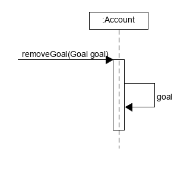

<h2>ΠΧ6. Εγγραφή στην εφαρμογή</h2>

<h2>ΠΧ7. Σύνδεση στην εφαρμογή</h2>

<!--<h3>Διάγραμμα ακολουθίας addProduct(Product product)</h3>

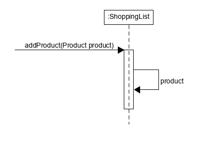

<h3>Διάγραμμα ακολουθίας removeProduct(Product product)</h3>

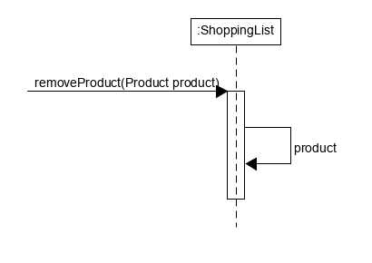-->

<h2>Coverage Report</h2>

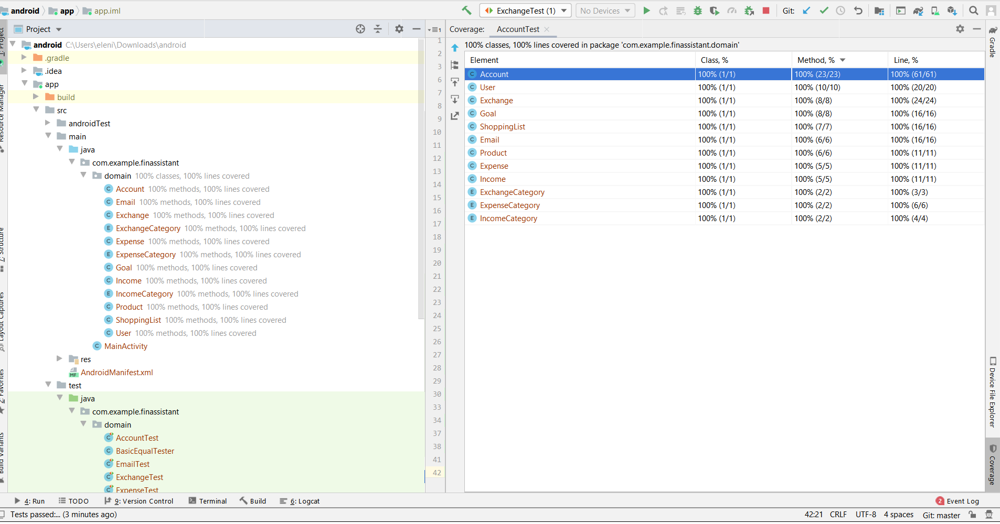