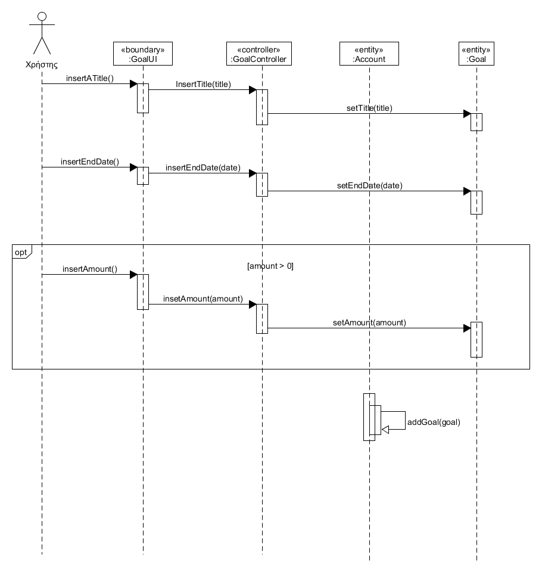

<h1>Εισαγωγή</h1>

<!--<h2>Ορισμοί ακρώνυμα και συντομογραφίες</h2>

<h2>Επισκόπηση</h2>

<h1>Συνολική Περιγραφή</h1>-->

<h2>Επισκόπηση μοντέλου περιπτώσεων χρήσης</h2>

| **Κωδικός** | **Τίτλος** | **Περιγραφή** |
| :---: | :-----: | :----------: |
| **ΠΧ1** | Αναφορές αφορολόγητου ορίου |Σύμφωνα με τις ηλεκτρονικές συναλλαγές του και το ύψος του εισοδήματός του, ο χρήστης μπορεί να δει εάν έχει "χτίσει" το αφορολόγητο, το οποίο αποτελεί το 30% του εισοδήματός του.|
| **ΠΧ2** | Αναφορές στόχων οικονομικής διαχείρισης |Ο χρήστης μπορεί να δει τα έσοδα, τα έξοδα και την πορεία εκπλήρωσης των στόχων του.|
| **ΠΧ3** | Διαχείριση εσόδων/εξόδων |Ο χρήστης εισάγει, διαγράφει και τροποποιεί τα έσοδα και τα έξοδά του.|
| **ΠΧ4** | Διαχείριση λίστας αγορών |Ο χρήστης δημιουργεί λίστες αγαθών προς αγορά, οι οποίες δημιουργούν κατάλληλη εγγραφή στα έξοδα.|
| **ΠΧ5** | Διαχείριση στόχων αποταμίευσης |Ο χρήστης μπορεί να δημιουργήσει νέους στόχους αποταμίευσης και να τους τροποποιήσει.|
| **ΠΧ6** | Εγγραφή στην εφαρμογή |Ο χρήστης πληκτρολογεί τα στοιχεία του (email και καινούργιο κωδικό) για να μπορέσει να εγγραφεί στην εφαρμογή.|
| **ΠΧ7** | Σύνδεση στην εφαρμογή |Ο χρήστης πληκτρολογεί τα στοιχεία του (email και κωδικό) για να μπορέσει να συνδεθεί στην εφαρμογή.|

<!--<h2>Υποθέσεις και Εξαρτήσεις</h2>
Μπορείτε να γράψετε παραδοχές που έχετε κάνει και εξαρτήσεις/περιορισμούς που αφορούν την υλοποίηση του συστήματος.-->

<h1>Ειδικές Απαιτήσεις</h1>

<h2>Περιπτώσεις Χρήσης</h2>

<h3>Οι ενδιαφερόμενοι και οι ανάγκες τους</h3>

| **Ενδιαφερόμενοι** | **Ανάγκη** |
| :------: | :------: |
| Χρήστης | Να βλέπει το ποσοστό του αφορολόγητου ορίου που έχει συμπληρώσει. |
| Χρήστης | Να καταγράφει τα έσοδα και τα έξοδά του. |
| Χρήστης | Να δημιουργεί αποταμιευτικούς στόχους. |
| Μηχανικοί Λογισμικού | Να γνωρίζουν το αρχικό πλάνο με βάση το οποίο θα διεξάγουν τις κατάλληλες απαιτήσεις. |
| Μηχανικοί Ανάπτυξης | Να έχει γίνει σαφής διατύπωση των απαιτήσεων του λογισμικού. |
| Μηχανικοί Ανάπτυξης  | Να γνωρίζουν το τελικό πλάνο της εφαρμογής. |
| Μηχανικοί Ανάπτυξης | Χρειάζονται τα κατάλληλα εργαλεία για την διεκπεραίωση του τεχνικού κομματιού. |

<h3>Actors του συστήματος</h3>

| **Actor** |
| :---: |
| Χρήστης |

<h3>Περιγραφές περιπτώσεων χρήσης</h3>

<h4> 
  
[ΠΧ1 Αναφορές αφορολόγητου ορίου](use_cases/uc1.md)

[ΠΧ2 Αναφορές στόχων οικονομικής διαχείρισης](use_cases/uc2.md)

[ΠΧ3 Διαχείριση εσόδων/εξόδων](use_cases/uc3.md)

[ΠΧ4 Διαχείριση λίστας αγορών](use_cases/uc4.md)

[ΠΧ5 Διαχείριση στόχων αποταμίευσης](use_cases/uc5.md)

[ΠΧ6 Εγγραφή στην εφαρμογή](use_cases/uc6.md)

[ΠΧ7 Σύνδεση στην εφαρμογή](use_cases/uc7.md)

</h4>

<h1>Συμπληρωματικές προδιαγραφές</h1>

<h2>Ποιοτικά χαρακτηριστικά</h2>

<h3>Απόδοση</h3>

1. Το σύστημα θα πρέπει να αποκρίνεται στο αίτημα ενός Χρήστη σε λιγότερο από 2 δευτερόλεπτα.

<h3>Ασφάλεια</h3>

1. Η πρόσβαση στην εφαρμογή πρέπει να παρέχεται μόνο σε εξουσιοδοτημένους Χρήστες, κατόπιν χρήσης κατάλληλου κωδικού χρήστη και password.

<h3>Αξιοπιστία</h3>

1. Το σύστημα δεν πρέπει να εμφανίζει περισσότερες από μία αστοχίες ανά 100 ώρες λειτουργίας.

<h3>Ευχρηστία</h3>

1. Η διαδικασία εισαγωγής στοιχείων θα πρέπει να είναι εύκολη για το Χρήστη.
2. Η διαδικασία διαγραφής στοιχείων θα πρέπει να είναι εύκολη για το Χρήστη.
3. Η εφαρμογή θα παρέχει μια λίστα με προεπιλεγμένες κατηγορίες εσόδων/εξόδων στον Χρήστη.

<h3> Διαθεσιμότητα </h3>

1. Η εφαρμογή θα είναι διαθέσιμη σε κινητά και σε tablet.
2. Ο Χρήστης έχει την δυνατότητα να συνδεθεί στον λογαριασμό του και σε διαφορετική συσκευή.

<h1>Υποστηρικτικό Υλικό</h1>

<h2>Μοντέλο Πεδίου</h2>

<h2>Συμπεριφορές</h2>

<h3>ΠΧ3. Εισαγωγή εσόδων</h3>

<h3>ΠΧ5. Δημιουργία αποταμιευτικών στόχων</h3>

<h3>ΠΧ6. Εγγραφή στην εφαρμογή</h3>

<h2>Επιχειρησιακοί κανόνες</h2>

| Επιχειρησιακοί Κανόνες | Περιγραφή |
| :------: | :------: |
| ΕΚ1 | Το email κάθε Χρήστη είναι μοναδικό. |
| ΕΚ2 | Ο κωδικός πρέπει να αποτελείται απο τουλάχιστον 8 χαρακτήρες. |

